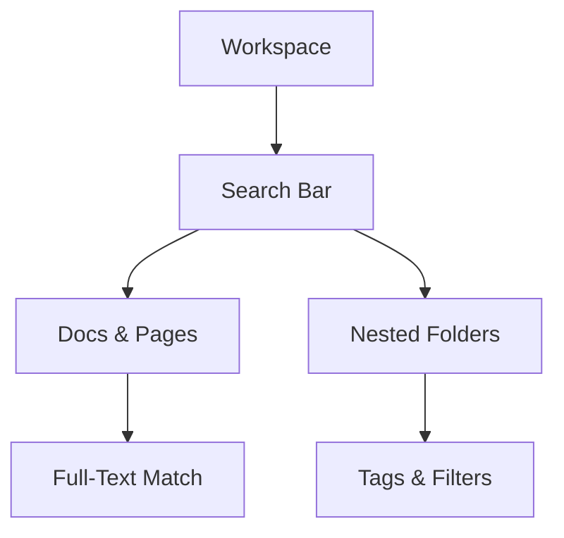

## Overview

Qiwi Cash provides powerful tools for creating, collaborating on, and managing your documentation. You get intuitive editing, real-time collaboration, advanced search, flexible exports, and a rich template library. These features help you build and maintain comprehensive docs efficiently.

<Columns cols={3}>
  <Card title="Document Creation" icon="edit-3" href="#document-creation">
    Rich text editor with Markdown support and media embeds.
  </Card>
  <Card title="Collaboration" icon="users" href="#collaboration">
    Real-time editing and version history for teams.
  </Card>
  <Card title="Search & Organization" icon="search" href="#search-organization">
    Full-text search and nested page structures.
  </Card>
  <Card title="Export & Sharing" icon="share-2" href="#export-sharing">
    Multiple formats and secure public links.
  </Card>
  <Card title="Templates" icon="file-text" href="#templates">
    Ready-to-use starters for APIs, guides, and more.
  </Card>
</Columns>

## Document Creation and Editing

Create professional documents quickly with Qiwi Cash's WYSIWYG editor. You support Markdown, code blocks, tables, and embeds from services like YouTube or Figma.

<Steps>
  <Step title="Start a New Doc" icon="plus">
    Click the `{New Document}` button in your workspace.

    ```
    # My Project Docs
    Welcome to your new document.
    ```
  </Step>
  <Step title="Add Rich Content" icon="edit-3">

    Insert images, videos, or code snippets using slash commands like `/image` or `/code`.

````markdown
```javascript
// Example API call
const response = await fetch('https://api.example.com/docs', {
  headers: { 'Authorization': `Bearer ${YOUR_API_KEY}` }
});
```
````
  </Step>
  <Step title="Publish" icon="globe">
    Hit `{Publish}` to make it live.
  </Step>
</Steps>

<Callout kind="tip">
  Use keyboard shortcuts like `Ctrl+K` for quick insert menus to speed up editing.
</Callout>

## Collaboration and Version Control

Work with your team in real-time. Multiple users edit simultaneously, with changes highlighted and cursor avatars.

<Tabs>
  <Tab title="Real-time Editing" icon="activity">
    See live changes as teammates type. Resolve conflicts automatically.
  </Tab>
  <Tab title="Version History" icon="git-branch">
    Revert to any version or compare diffs.

    <Image
      src="https://via.placeholder.com/800x400/3B82F6/white?text=Version+History+Diff"
      alt="Version history comparison view"
      width="800"
      height="400"
    />
  </Tab>
</Tabs>

Qiwi Cash tracks every change with commit-like history. You restore previous versions or branch docs for experiments.

## Search and Organization Features

Find anything instantly with full-text search across your workspace. Organize docs hierarchically or with tags.



Use advanced filters for dates, authors, or custom metadata.

<CodeGroup tabs="JavaScript,Python">
```javascript
// Search API example
const results = await fetch('https://api.example.com/search?q=authentication', {
  headers: { Authorization: `Bearer YOUR_API_KEY` }
});
```
```python
import requests
response = requests.get(
    'https://api.example.com/search?q=authentication',
    headers={'Authorization': 'Bearer YOUR_API_KEY'}
)
```
</CodeGroup>

## Export and Sharing Options

Share docs publicly or export to PDF, HTML, or Markdown.

<Tabs>
  <Tab title="Public Links" icon="link">
    Generate shareable URLs with optional passwords.
  </Tab>
  <Tab title="Exports" icon="download">
    | Format | Use Case |
    |--------|----------|
    | PDF    | Printing, reports |
    | HTML   | Websites, embeds |
    | MD     | GitHub repos |
  </Tab>
</Tabs>

## Template Library

Jumpstart projects with pre-built templates.

<Expandable title="Popular Templates" default-open="true">
  - API Reference: Complete with endpoints and schemas
  - User Guide: Step-by-step tutorials
  - Changelog: Versioned updates
  - Troubleshooting: FAQ structure

  Customize any template in seconds.
</Expandable>

<Callout kind="success">
  Explore [Quickstart](/quickstart) to try these features hands-on.
</Callout>